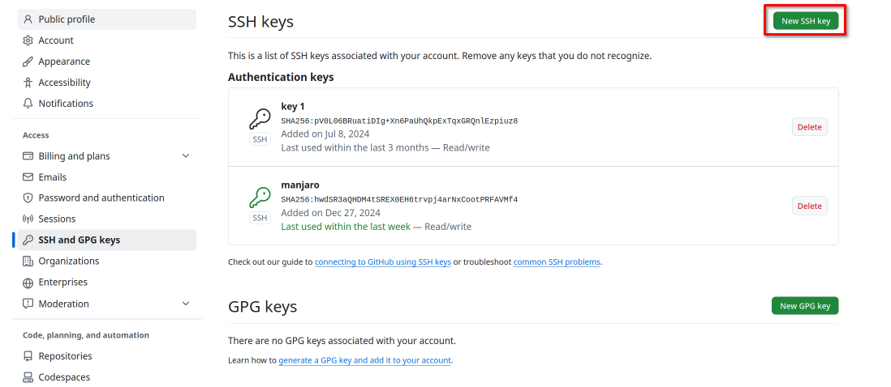

1. Create `.ssh` folder in your `home` directory and go to it.

2. Generate ssh keys (how many you need) with command 

```properties
ssh-keygen -t ed25519 -C <your_email@example.com>
```
then choose file name. `-C <your_email@example.com>` part seems to be unnecessary. It is just comment.

3. Run ssh-agent in **BASH** with command

```properties
eval "$(ssh-agent -s)"
```

4. Add ssh keys to the ssh agent (not public)

```properties
ssh-add ~/.ssh/<key_name>
```

5. Copy public keys to Github accounts.


6.  Create `config` file in `.ssh` directory with the following content

```properties
# github <account_name>
Host github.com-<account_name> #
HostName github.com
PreferredAuthentications publickey
IdentityFile ~/.ssh/<key_name>

# github <account_name>
Host github.com-<account_name>
HostName github.com
PreferredAuthentications publickey
IdentityFile ~/.ssh/<key_name>
```

The file could contain any number of keys.

6. Clone a repository from Github using ssh

```properties
git clone git@github.com-<account_name>:your_username/your_repository.git
```
Example: `git@github.com-eqslab:eqslab/website.git`. Typically, just copy line from Github and add `-<account_name>` after `.com`.

---

_More information:_

- [article](https://www.ayyaztech.com/blog/how-to-use-multiple-github-accounts-on-the-same-machine)

- ▶️ https://www.youtube.com/watch?v=lAPcvItvdy0&t

- ▶️ https://www.youtube.com/watch?v=N2hMGEeYR7c&t
